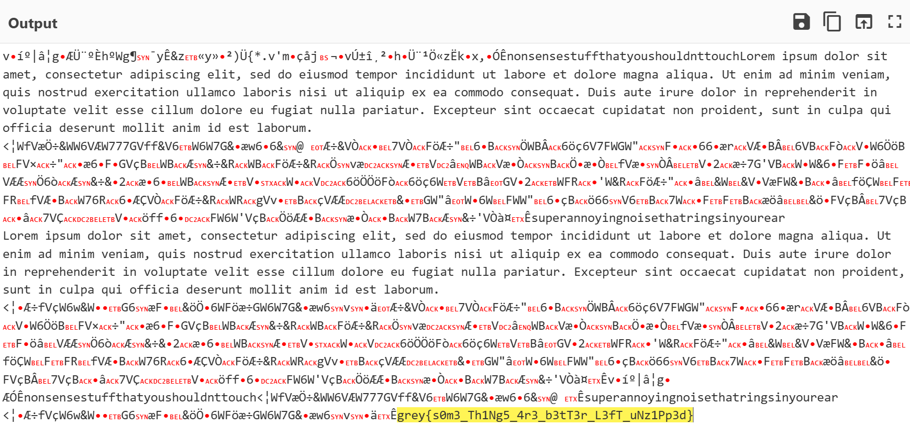

# Challenge Details
Challenge Name: Shy Zipper  
Category: Forensics
Author: iam_hybrid

# Challenge Description
My zip file ate my flag and won't open up! It also has anxiety so I don't want to force it open if it doesn't want to open up. Can you help me get back my flag?  

# Solve
The zip file has no password and allows you to unzip it. Inside reads a file named don't unzip me!.txt, the text reads:  
you shouldn't have come here. But since you did, the flag is in base64, so don't you dare string it.  

Using this hint, I went back to the zipped file and strings it, here is the exact command I used: `strings shy.zip| | less`, I also renamed the zipped file to shy for simplicity.  
This gave me a bunch of nonsense, since I know that the flag is in base64, I copy and pasted the whole thing into a base64 decoder, and I found the flag at the bottom.  

# Flag
grey{s0m3_Th1Ng5_4r3_b3tT3r_L3fT_uNz1Pp3d}
