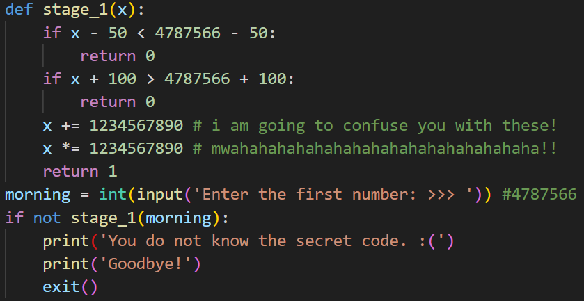
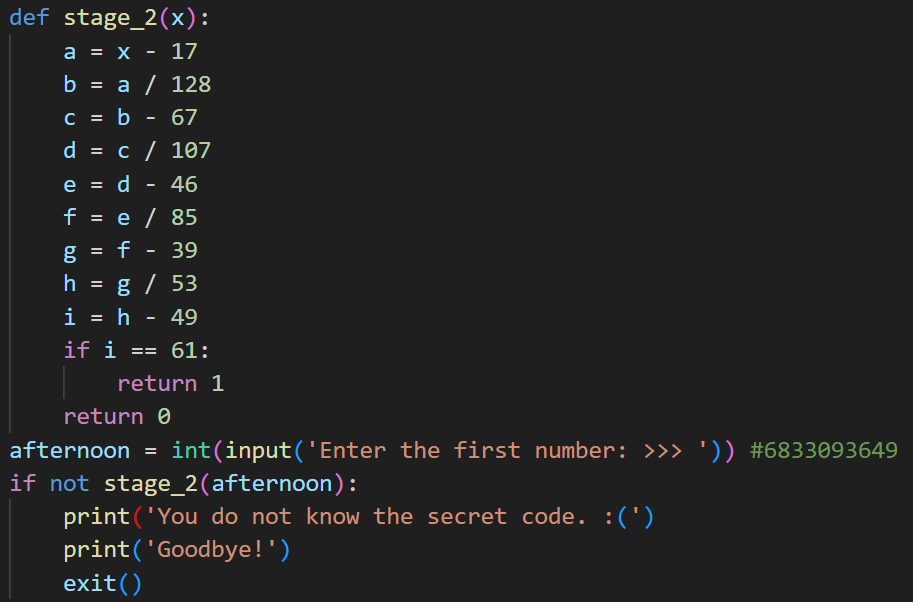
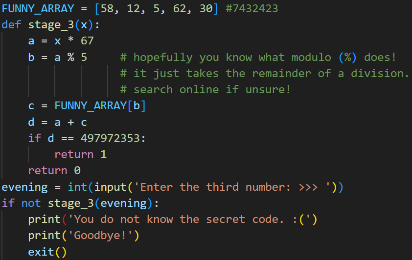

# Challenge Details
Challenge Name: Artifact 10  
Category: Reverse Engineering  
Author: cewau  

# Challenge Description
Code reading practice (Python)

Getting your feet wet!

# Solve
### Stage 1
  
We have to input a secret number. From the function, we can see that when `x - 50 < 4787566 - 50` and `x + 100 > 4787566 + 100` it returns 0.  
Using the laws of inequality, we can add 50 to both sides and remove 100 from both sides, respectively. This tells us that when `x < 4787566` and when `x > 4787566`  
Hence, $x = 4787566$ for us to get an output of 1.  

### Stage 2
  
We know what i must be for us to get an output of 1. In this case, we can simply reverse each equation, giving us the value that $x = 4787566$  

### Stage 3
  
This may seem harder than it is supposed to be. As there is a limited number of values in the array, we can find a value of 497972353 - FUNNY_ARRAY\[b\] such that it is divisible by 67.  
Using this, we can find out that $x = 7432423$  

# Flag
grey{4787566_6833093649_7432423}
