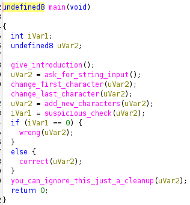
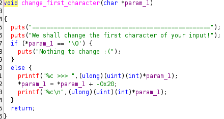
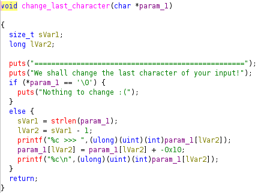
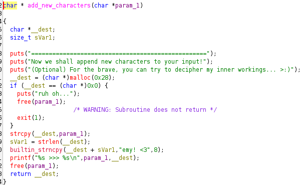
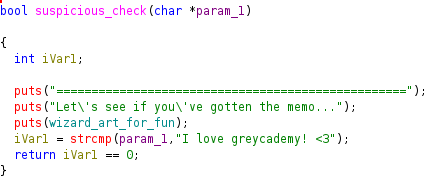
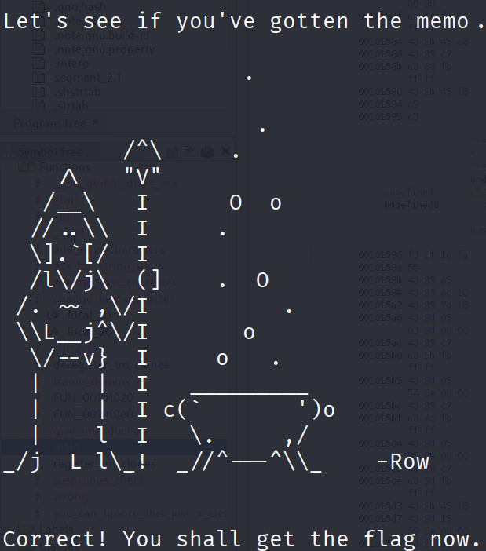

# Challenge Details
Challenge Name: Artifact 11 Decomplilation
Category: Reverse Engineering
Author: cewau

# Challenge Description
IDA / Decompilation practice (C)

# Solve
### main()

We can see that it takes in a string input from us, changes the first and last character, adds new characters and goes through suspicious checks.

### change_first_character()
  
The ASCII manipulation causes a lowercase to become an uppercase.  

### change_last_character()
  
This adds a fixed ASCII value change to the last char.  

### add_new_character()
  
This adds the phrase "emy! <3" to the end of the plaintext.  

### suspicious_check()

Checks if the input is the same as "I love greycademy! <3"

### Gameplan
We can reverse the operation and find the initial input since we know what the final input is: "I love greycademy! <3"  
We can first reverse add_new_character() by "unappending" the phrase "emy! <3" at the end, giving us "I love greycad"
Reversing the change_last_character() gives us "I love greycat" and reversing the change first character gives us the final payload: "i love greycat"

# Additional Remarks
I think that the initial input to give the flag is a very nice touch with the theme of the organising committee.  
Also, look at the art:  

Thank you!

# Flag
grey{cr4ck3d_1t_0p3n}
