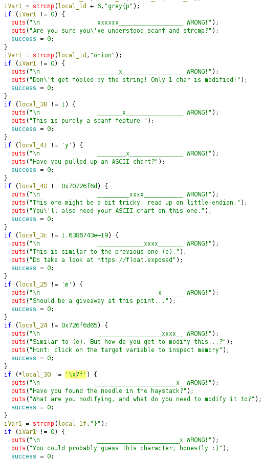
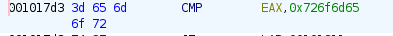
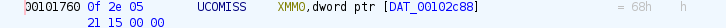

# Challenge Details
Challenge Name: Artifact 13 Functions  
Category: Reverse Engineering  
Author: cewau  

# Challenge Description
Exploration on common C functions (I/O, string), and how variables and types work.

# Solve
The challenge takes in an input and compares different parts of it multiple times  

### Plaintext comparison
The compared detail is in plaintext, allowing us to directly copy and paste it in, there is an exception for the second comparision as the variable has memory for 1 char which will be compared with the first letter of the hardcoded plaintext 'onion' so that value must be o.  

### Memory
This one compares the variable with a value in the memory, simply click on the memory address and decode the hexadecimal there into ASCII values to get the plaintext.

  
  
  

Copying down the values of the hex and converting into string gives us the plaintext of the value (There is also an equal sign there its because of CMP, just ignore it)

### Pointer
It compares the pointer value to the hardcoded value, using the pointer value you can reverse it and get the plaintext.

# Flag
grey{po1ymorphic_memory}
