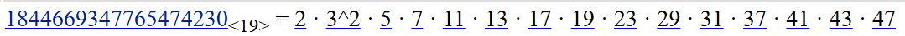

# Challenge Details
Challenge Name: Curve ball  
Category: Cryptography  
Author: Alan Davide Bovo <@AlBovo>  
Final Points: 286  

# Challenge Description
Our casino's new cryptographic gambling system uses elliptic curves for provably fair betting.  
We're so confident in our implementation that we even give you an oracle to verify points!  
nc curve.ctf.pascalctf.it 5004  

# Solve
The Curve used is not conventional, the order of the curve is factorable, making it weak to pholig-hellman.  
Factoring of the curve order:  
  

# Flag
pascalCTF{sm00th_0rd3rs_m4k3_3cc_n0t_s0_h4rd_4ft3r_4ll}  
