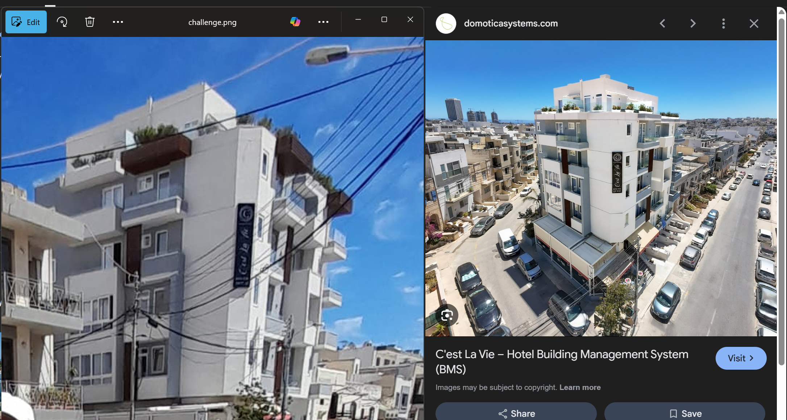
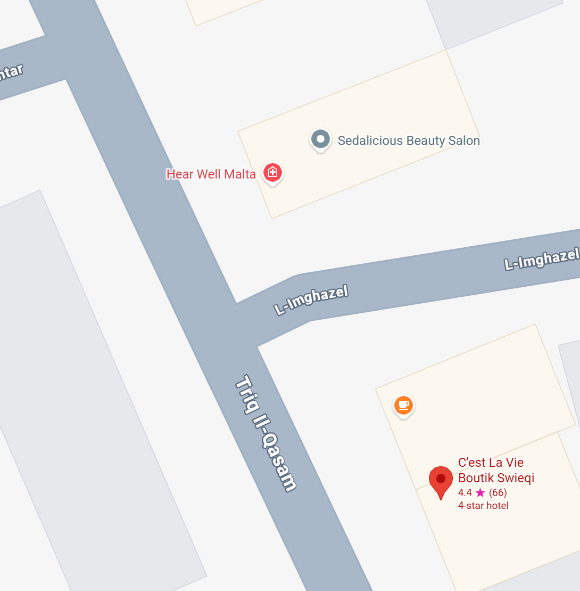

# Challenge Details
Challenge Name: Geoguesser  
Category: AI  
Author: Alan Davide Bovo <@AlBovo>, Fabio Fantini <@FabioFant>  

# Challenge Description
Alan Spendaccione accumulated so much debts that he travelled far away to escape Fabio Mafioso, join the mafia and help Fabio catch Alan!  
The flag format is pascalCTF{YY.YY,XX.XX} where Y=latitude and X=longitude, round the numbers down.  

# Solve
We are given a picture of a man standing at the corner of a crosswalk.  
I first tried to look at the names of the shops behind him, most notably a bakery and a hotel. It was very blurry, and I couldn't see their names, so I reversed Google Image the location and it gave me this.  

  

Searching the hotel's name: C'est La Vie  
Reversing his location using the image, we can find the exact coordinates he was standing on.  
We get this location on Google maps:  

 
# Flag
pascalCTF{35.92,14.47}  
