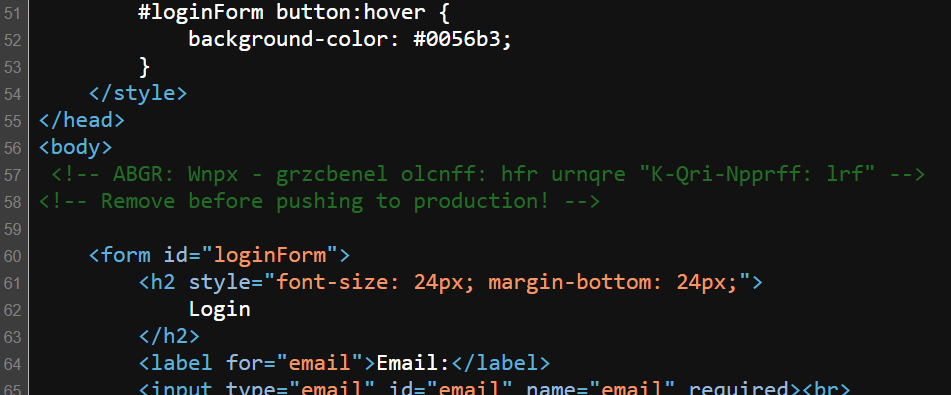
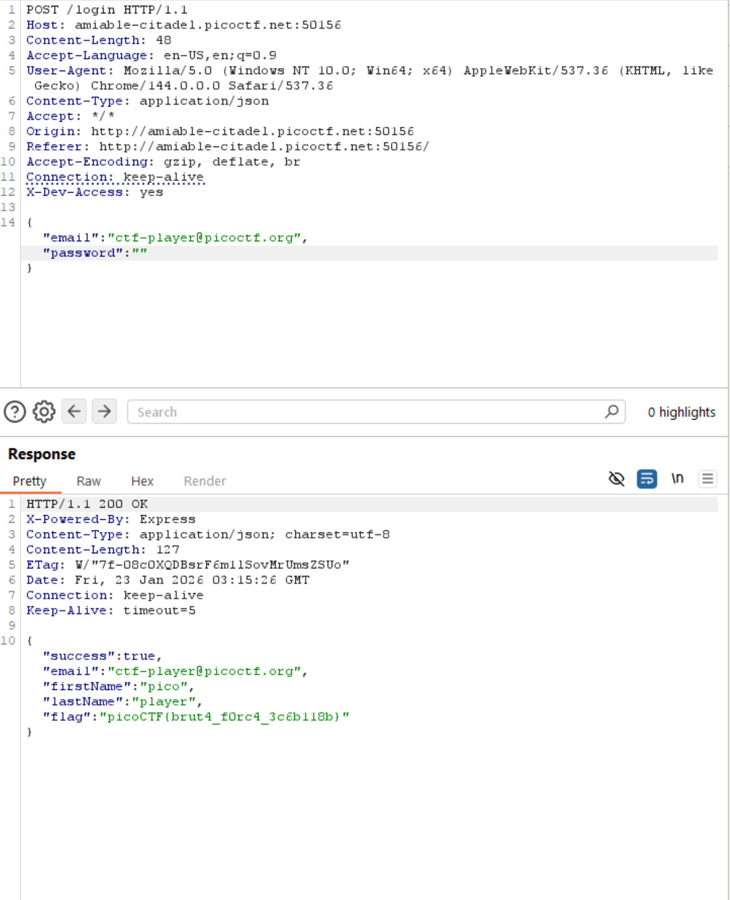

# Challenge Details
Challenge Name: Crack the Gate 1  
Category: Web Exploitation/Easy  

# Challenge Description
We’re in the middle of an investigation. One of our persons of interest, ctf player, is believed to be hiding sensitive data inside a restricted web portal. We’ve uncovered the email address he uses to log in: ctf-player@picoctf.org. Unfortunately, we don’t know the password, and the usual guessing techniques haven’t worked. But something feels off... it’s almost like the developer left a secret way in. Can you figure it out?  
Additional details will be available after launching your challenge instance.  

Hint 1: Developers sometimes leave notes in the code, but not always in plain text.  
Hint 2: A common trick is to rotate each letter by 13 positions in the alphabet.  

# Solve
Going into the website you see a login interface, checking the source code reveals the following comments left by the developer.  

  

Using the second hint, we can derive that this comment is encoded using a ROT13 cipher which when decoded reveals the following note.  

  

This tells us that we are able to use "X-Dev-Access: yes" to bypass the password requirement.  
By using Burp Suite, we can edit our send request to contain a valid username and the X-Dev-Access: yes to bypass the password to obtain the flag.  

  

# Flag
picoCTF{brut4_f0rc4_3c6b118b}
