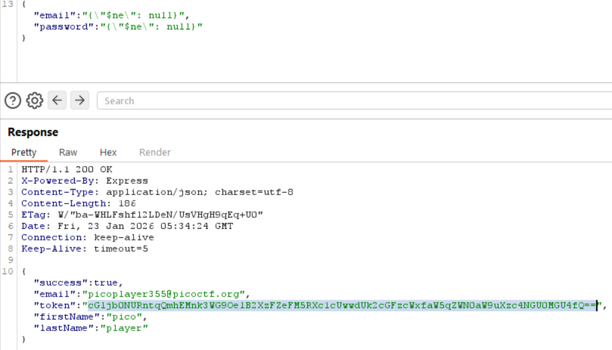
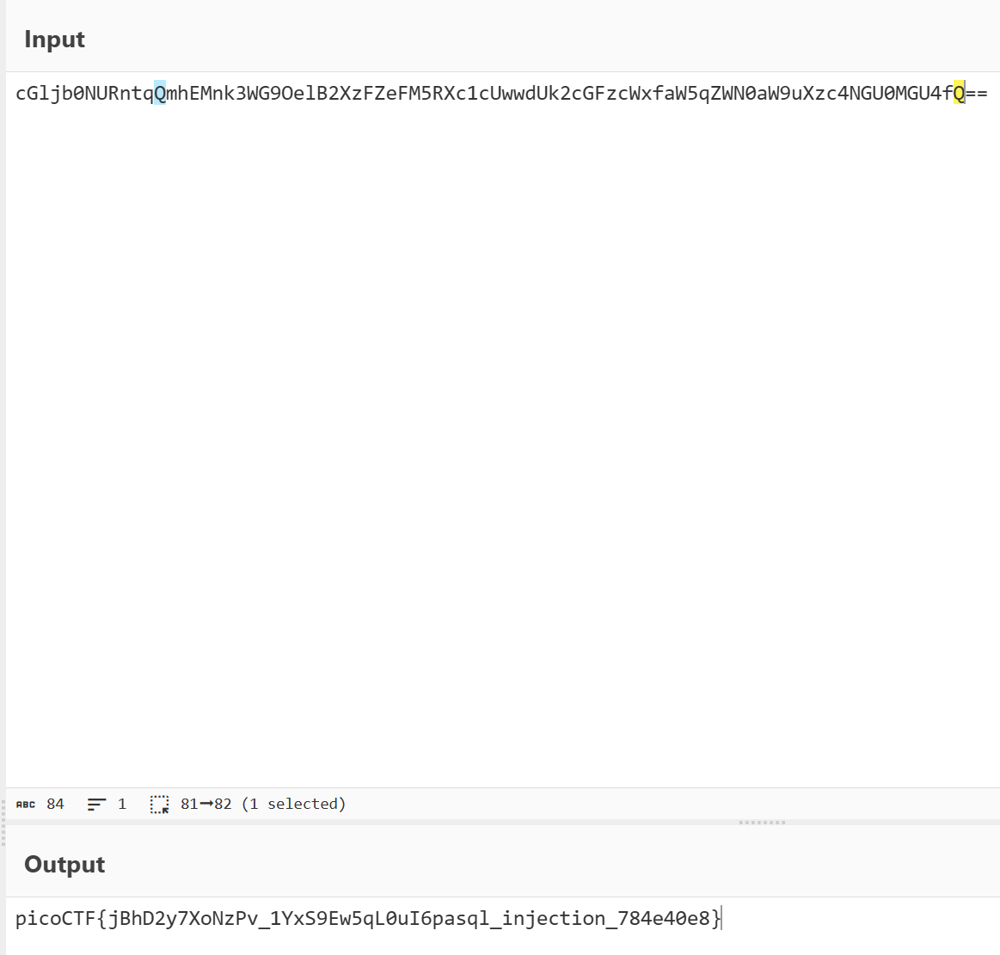

# Challenge Details
Challenge Name: No SQL Injection  
Category: Web Exploitation/Medium  
Author: NGIRIMANA Schadrack  

# Challenge Description
Can you try to get access to this website to get the flag?  
You can download the source here.  

Hint 1: Not only does SQL injection exist, but also Non-SQL injection exists.  
Hint 2: Make sure you look at everything the server is sending back.  

# Solve
Going to the website, we see a login page. Using Burp Suite, we can see that the information is being sent to a backend for validity checking througha JSON file.  
Seeing the X-Powered-By: Express, we also know that they are using Node.js, and infering from the challenge description and hints, we can see that the database is MongoDB

By trying out this payload -> {"$ne": null}, as the code does not have any input cleanup before processing, we are able to login and get the flag successfully.  

Decoding the flag from base64.  

# Flag
picoCTF{jBhD2y7XoNzPv_1YxS9Ew5qL0uI6pasql_injection_784e40e8}
